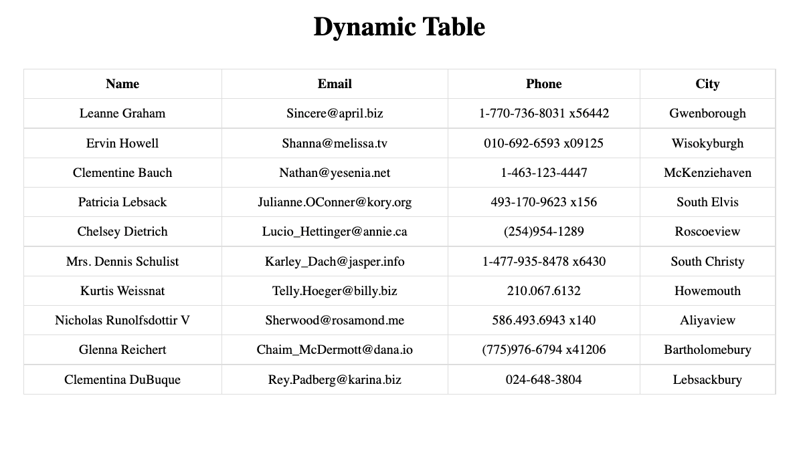

This project was bootstrapped with [Create React App](https://github.com/facebook/create-react-app).

## Available Scripts

In the project directory, you can run:

### `yarn install`

Instal All dependencies in this project

### `yarn start`

Runs the app in the development mode. 
Open [http://localhost:3000](http://localhost:3000) to view it in the browser.

### Link

jsonplaceholder: https://jsonplaceholder.typicode.com/users
axios: https://axios-http.com/

### Video Tutorial

You can see my youtube video for this project in [here](https://youtu.be/uFGKOCmEXPw)